<!--
  This file is part of code_saturne, a general-purpose CFD tool.

  Copyright (C) 1998-2026 EDF S.A.

  This program is free software; you can redistribute it and/or modify it under
  the terms of the GNU General Public License as published by the Free Software
  Foundation; either version 2 of the License, or (at your option) any later
  version.

  This program is distributed in the hope that it will be useful, but WITHOUT
  ANY WARRANTY; without even the implied warranty of MERCHANTABILITY or FITNESS
  FOR A PARTICULAR PURPOSE.  See the GNU General Public License for more
  details.

  You should have received a copy of the GNU General Public License along with
  this program; if not, write to the Free Software Foundation, Inc., 51 Franklin
  Street, Fifth Floor, Boston, MA 02110-1301, USA.
-->

\page cs_ug_catalyst In situ postprocessing with ParaView Catalyst

[TOC]

Basic principles
================

It is possible to generate postprocessing output directly from a running
code_saturne simulation using
[ParaView Catalyst](https://kitware.github.io/paraview-catalyst),
provided support for this tool is specified at build time (see
[installation documentation](@ref autotoc_md0)).

To define in-situ postprocessing output, the following steps are required:

- Produce an initial output using a post-hoc output format (e.g. EnSight, MED, or CGNS).
- Define your visualization in ParaView.
- Export a catalyst Python script from ParaView.
  * Modify that script if necessary or desired.
- Copy the script to a case's DATA directory.
- Define an output writer using the "catalyst" format (or change the format
  of an existing one).
- Run the computation.

Step by step example {#cs_ug_catalyst_step_by_step}
====================

Let us consider that after an initial code_saturne run (at least over a few
time steps), a visualization pipeline is set up using ParaView, such as
that below (using the code_saturne Tee_Junction tutorial, and based on
the default EnSight format output):

Preparing the Catalyst script
------------------------------

### Step 1: setup visualization from code_saturne computation data

Load post-hoc (i.e. classical) visualization data from a prior simulation
and prepare a visualization pipeline.

<p><a class="anchor" id="fig_ug_catalyst_01_initial_pipeline"></a></p>
<div class="image">
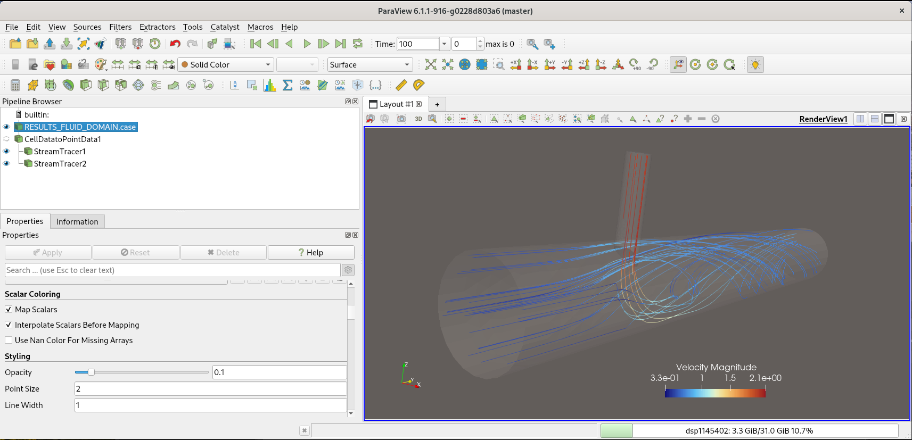
<div class="caption">Initial Visualization</div>
</div>

### Step 2: Rename the pipeline's input

The initial input node's name is based on the path of the file
loaded for visualization. It must be renamed to that of the future associated
code_saturne writer. The name itself is not important, but those of the pipeline
and that of the code_saturne writer must match, so using a name such
as *catalyst* (also the name of the writer format string) or
*input* (as in older ParaView Catalyst versions) is good option.

<p><a class="anchor" id="ug_catalyst_02_rename_input"></a></p>
<div class="image">
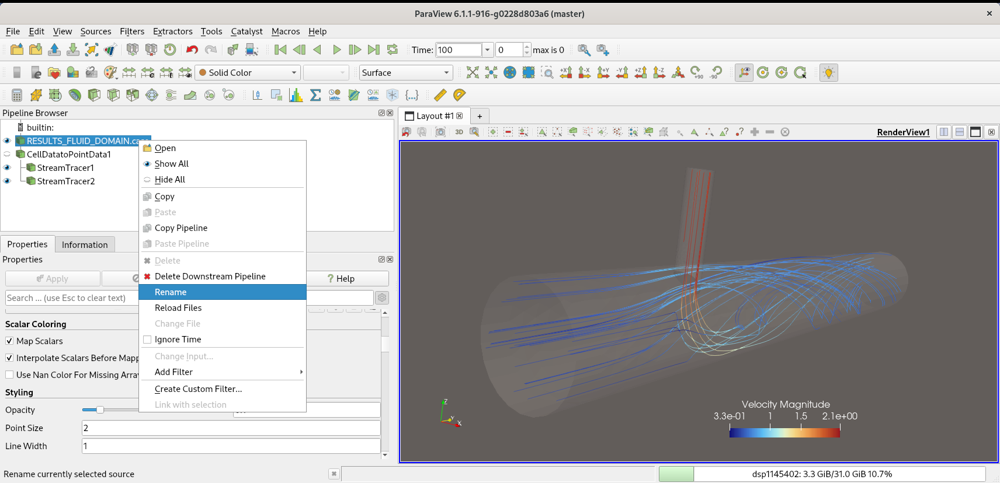
<div class="caption">Renaming the pipeline input</div>
</div>

The initial input node's name is based on the path of the file
loaded for visualization.

### Step 3: prune the associated data path (optional)

For example with EnSight input,
the *Case File Name* appearing in the input node's *Ensight Reader*
properties initially contains the absolute file path of the
loaded data.

This step is optional, but recommended: this path may be used to
later run the generated Script using post-hoc files instead of
in-situ data, and is part of the ParaView state, which can be saved or reloaded, so using a relative path instead of the absolute allows using and adapting the script in other runs or with moved output data.
If forgotten, the generated script can also easily be cleaned up
in a later stage.

<p><a class="anchor" id="fig_ug_catalyst_03_local_path"></a></p>
<div class="image">
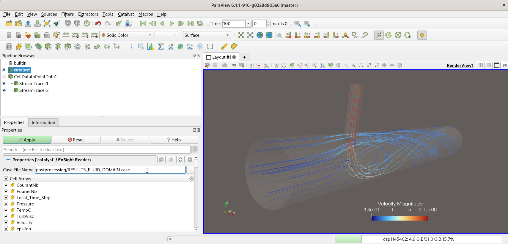
<div class="caption">Prune absolute path</div>
</div>

### Step 4: add a ghost cells filter if (and only if) needed.

Depending on the filters used, ghost cells will be needed in parallel to
exchange data of process boundaries. This is not needed for cut, threshold, or
glyph filters for example, but is needed when interpolating cell data to
point data, for streamlines, contours, ... and in general whenever
a filter needs to access data from neighbor elements when postprocessing
a given mesh element. This is also the case when applying transparency
to a volume mesh, as neighbor cell connectivity is needed to reconstruct
its boundary, and some interior faces will show as boundary faces if
missing ghost data.

If ghost cells were not already defined, a *ghost cells* filter man
be added at any time, then move upwards in the pipeline, by changing
the input of previously defined filters:

<p><a class="anchor" id="fig_ug_catalyst_04_add_ghost_cells_1"></a></p>
<div class="image">
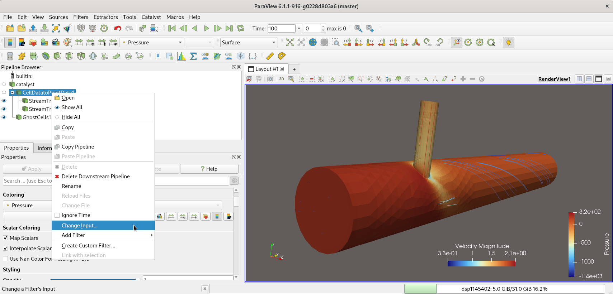
<div class="caption">Insert ghost cells filter</div>
</div>

After right-clicking on *Change input*, a dialog similar to the
following will appear:

<p><a class="anchor" id="fig_ug_catalyst_05_add_ghost_cells_2"></a></p>
<div class="image">
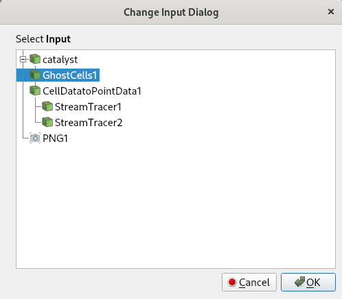
<div class="caption">Insert ghost cells dialog</div>
</div>

Note that unfortunately, ghost cells generation in parallel ParaView
runs is often observed to be fragile, so use this filter only with
filters requiring it, not for simple cuts. Also, is is possible to
generate ghost cells only on the filter directly upstream of the one requiring
them, so if for example a *Cell Data to Point Data* filter is used only on a
given cut plane, ghost cells could be generated only on that cut,
reducing the volume of parallel data which must be exchanged and maybe
improving robustness.

### Step 5: Define data extractors.

Without data extractors, the script will
generate no output. In most cases, Catalyst is used to produce images,
such as in this example, but it may also be used to filter the output
and save it to produce VTK or CGNS files which may be further processed,
as well as .csv data.

<p><a class="anchor" id="fig_ug_catalyst_06_extractor_1"></a></p>
<div class="image">
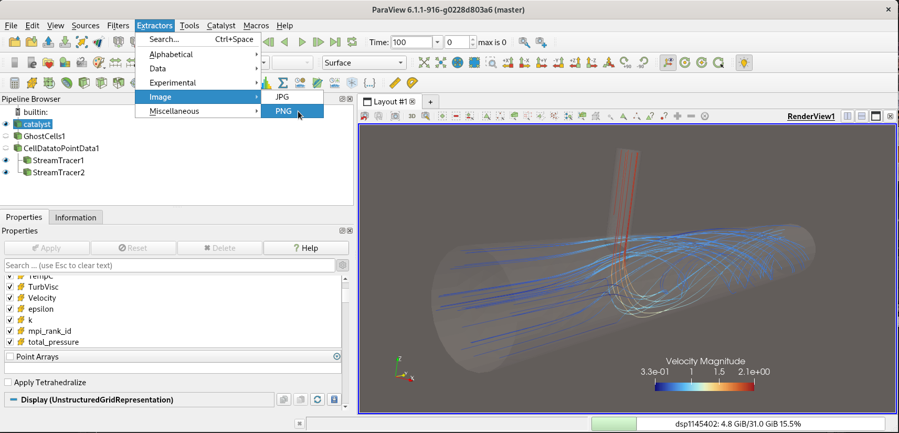
<div class="caption">Define extractor</div>
</div>

Once an extractor is added, different settings may be defined.
For better clarity, or when using multiple Catalyst scripts,
it is often useful to adjust output file names (which can use wildcards
between `{}` braces).
Also here, we override the color palette so as to use a white background,
often preferred for inclusion of images in reports or web pages.
This may also be done at the general ParaView settings level, depending
on user preferences.

<p><a class="anchor" id="fig_ug_catalyst_07_extractor_2"></a></p>
<div class="image">
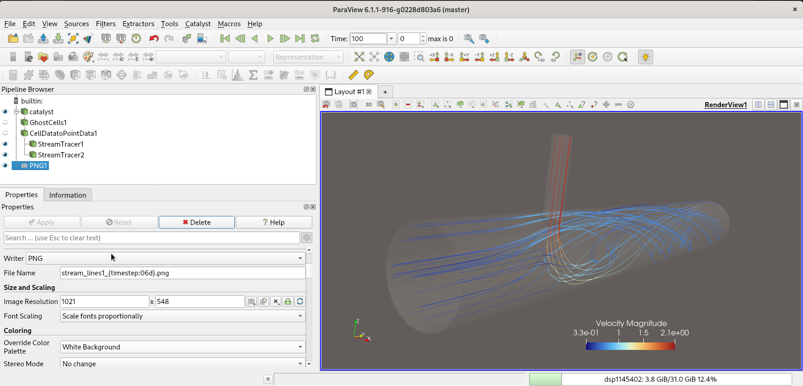
<div class="caption">Extractor dialog</div>
</div>

### Step 6: save Catalyst State to generate the actual script.

The generated script
is very similar to a classical Python state file, which is reflected
in the menu location for this option:

<p><a class="anchor" id="fig_ug_catalyst_08_save_state_1"></a></p>
<div class="image">
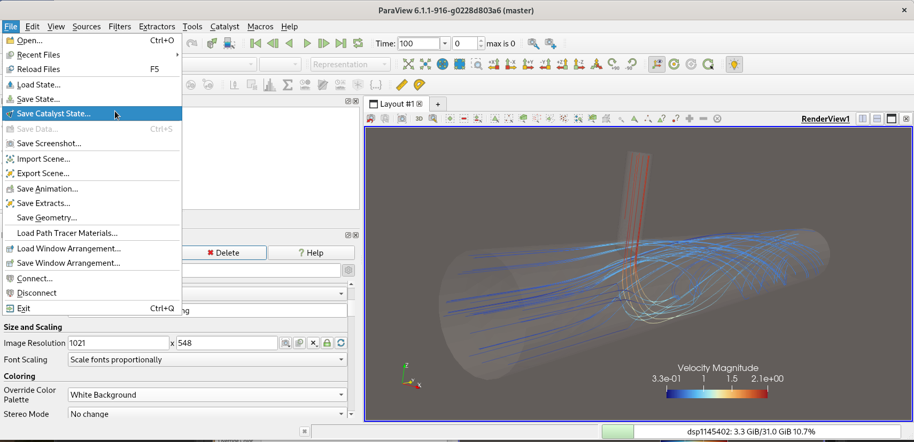
<div class="caption">Save Catalyst state</div>
</div>

A first dialog allows selecting the filename and output location:

<p><a class="anchor" id="fig_ug_catalyst_09_save_state_2"></a></p>
<div class="image">
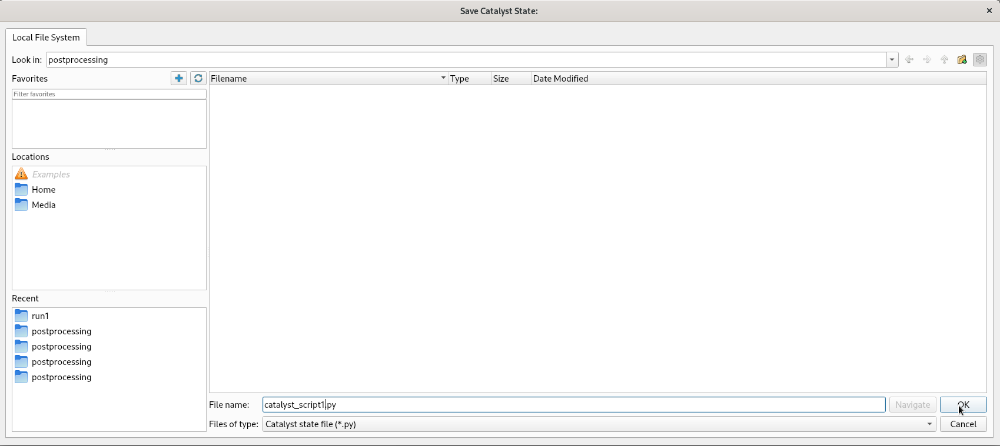
<div class="caption">Catalyst state file dialog</div>
</div>

A second dialog allows setting additional options. In most cases,
the frequency is left at 1, as it can be managed upstream in the
code_saturne writer (if code_saturne outputs to Catalyst every *n*
time steps, setting this value to *k* would lead to actual output
occuring only every *n* times *k* time steps).
In some complex cases, using a Python-defined in the *Global Trigger* option  may be useful.

<p><a class="anchor" id="fig_ug_catalyst_10_save_state_3"></a></p>
<div class="image">
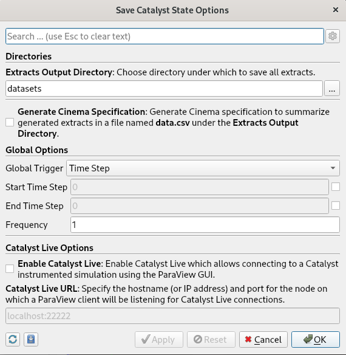
<div class="caption">Catalyst state settings dialog</div>
</div>

### Step 7: edit the script (optional)

The script may be edited and cleaned-up manually, if desired. In the following
figure, the "reader" definition near the beginning of the file is shown.
A path may be converted to or from a relative path, and arrays not used in the
script may be pruned (this could also have been done through the ParaView GUI,
but is often omitted at that staged). Other Python improvementsn parametrization,
or filter and view settings may be done here.

<p><a class="anchor" id="fig_ug_catalyst_20_alternative_cleanup"></a></p>
<div class="image">
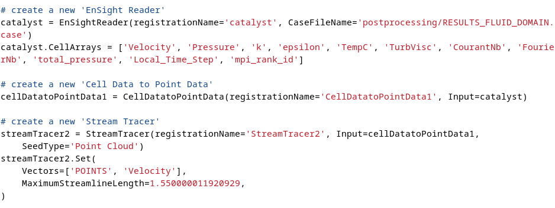
<div class="caption">Direct edit of Catalyst script</div>
</div>

Associating the Catalyst script with code_saturne
-------------------------------------------------

Now that the Catalyst script is ready, it must be moved or copied to
the case's `DATA` directory.

A new writer using the Catalyst format should be defined, or an existing one
renamed. The name should match that of the catalyst pipeline input.
In many cases, Catalyst output allows generating output at a higher frequency
than post-hoc output while keeping a low output data volume. In this example, we generare an output every 50 time steps:

<p><a class="anchor" id="fig_ug_catalyst_30_add_cs_writer"></a></p>
<div class="image">
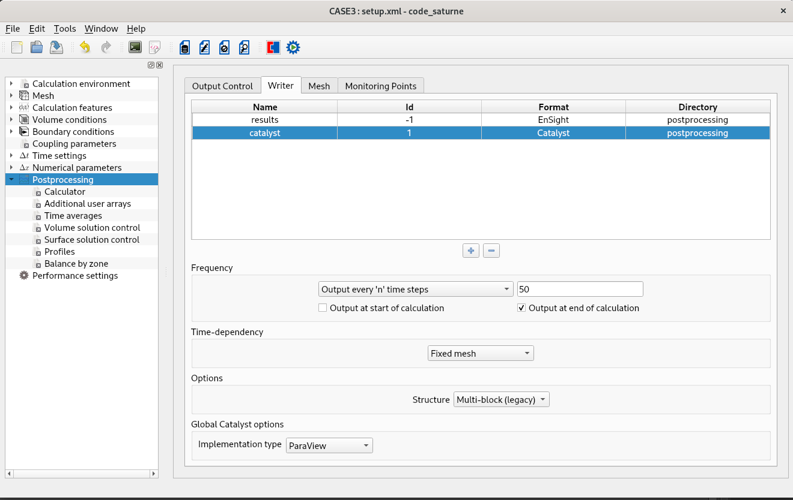
<div class="caption">Add code_saturne Catalyst writer</div>
</div>

Once the writer is created, do not forget to associate it with the needed meshes:

<p><a class="anchor" id="fig_ug_catalyst_31_associate_cs_mesh"></a></p>
<div class="image">
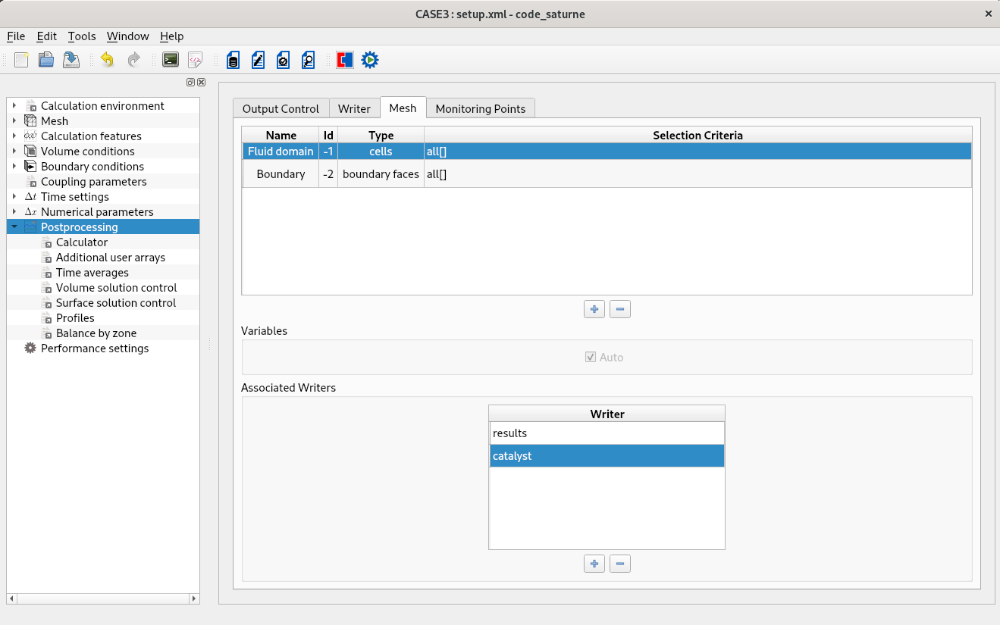
<div class="caption">Associate postprocessing mesh to Catalyst</div>
</div>

### Catalyst writer options and implmentation selection

With Catalyst 2, several additional options are available:

- Structure organizes the output hierarchy to match that used when
  generating the Catalyst script:
  * **Multi-bloc (legacy)** matches the output of legacy mesh format readers,
    such as the default EnSight readers.
  * **Partitioned Dataset** matches the output of more recent mesh readers.

- Implementation type allows choosing between ParaView (the default), a Catalyst
  stub, or Catalyst 1 if available.

Generated output
----------------

When the code is next run, the output should include that generated with
Catalyst. Unless modified in the script's options, output will be grouped
in a `datasets` subdirectory of the run/results directory.

### First run: check for defects

With the current example, when running 50 time steps on 2 MPI ranks,
the first output appears as follows:

<p><a class="anchor" id="fig_ug_catalyst_40_stream_lines_50"></a></p>
<div class="image">
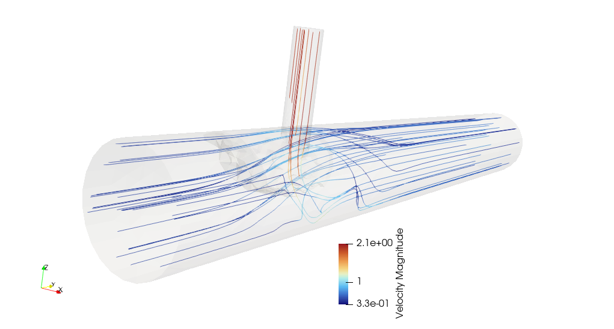
<div class="caption">Catalyst output at 50 time steps</div>
</div>

In this output, we observe that the legend text is vertical instead of
horizontal. This positioning is quite sensitive to the render window size, so
forcing some color legend properties in ParaView instead of keeping the defaults may
be recommended. Forcing the size of the render view in Catalyst to the size
of the view in the ParaView GUI may also help. Here, we force the orientation
of the color bar in ParaView.

Also, some transparency artifacts appear in the middle of the
domain. We may notice that in the initial pipeline setup, as shown in the
previous snapshots, the "catalyst" input node is displayed.
In this case, it was used with a constant color and transparency (10%) to
highlight the domain boundary.
But as we have mentioned in *step4* pertaining to ghost cells, using
transparency with a volume mesh requires using ghost cells to avoid
extra boundaries (at processor boundaries).

To solve this, we simply hide the "catalyst" input node, and show
the *GhostCells1* node instead, with similar view settings.
An alternative solution would be to also output the boundary
mesh from code_saturne to Catalyst, and shown that boundary mesh instead.
Depending on whether Ghost cells are needed for other filters or not,
either solution may be preferred.

### Results after tweaks

With the current example and the corrected script, when running 200 time steps
on 2 MPI ranks, the first output appears as follows:

<p><a class="anchor" id="fig_ug_catalyst_40_stream_lines_50"></a></p>
<div class="image">

<div class="caption">Catalyst output at 50 time steps</div>
</div>

And the last output shows a slightly different flow, as convergence has
progressed:

<p><a class="anchor" id="fig_ug_catalyst_41_stream_lines_200"></a></p>
<div class="image">
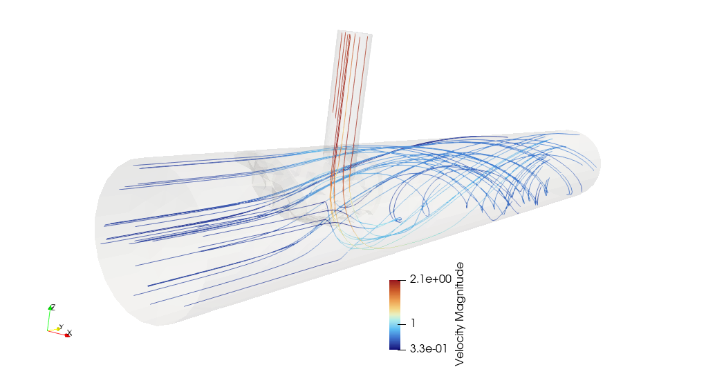
<div class="caption">Catalyst output at 200 time steps</div>
</div>

When things fail...
----------------

If for some reason Catalyst is unable to produce an output, it may either
lead to a crash, which can be analyzed in the usual manner,
and where the back-trace should lead to the faulty operation.

In other cases, it may fail to produce an output, but not cause code_saturne
to crash. In this case, a `catalyst.log` file should be generated in
the execution directory, and contain relevant information. In any case,
it is recommended to check for the presence of this file after a
computation, and adjust the script (or report bugs) to avoid these errors.

Setting the `PARAVIEW_LOG_CATALYST_VERBOSITY=INFO` environment variable should
increase the verbosity of logs relative to Catalyst in ParaView's standard
logging system.

Also, the `CATALYST_DEBUG` environment variable enables upstream logs about
the Catalyst implementation loading procedure. This allows checking
which implementation is actually loaded.

### Using Catalyst Replay

With Catalyst 2, a very useful tool is [Catalyst Replay](https://catalyst-in-situ.readthedocs.io/en/latest/catalyst_replay.html), which allows dumping Catalyst output to a
selected directory, and replay Catalyst scripts without needing to run the full
computation.

A `catalyst_replay` executable file should be present in the standalone Catalyst
installation's `bin` directory.

To prepare a replay, one should set the following environment variables:

`CATALYST_IMPLEMENTATION_NAME=stub`
`CATALYST_DATA_DUMP_DIRECTORY` should be set to the chosen dump directory name.

When running the code, the Catalyst output will be replaced by a data
dump to the selected directory.

Once this is available, `CATALYST_IMPLEMENTATION_NAME` should be set
to `paraview`, and `CATALYST_IMPLEMENTATION_PATHS` should be set to the
ParaViw Catalyst library path (e.g. the path containing the
`libcatalyst-paraview.so` file, usually `<paraview_install_path>/lib/catalyst`).

Catalyst Replay can be used by calling:

`mpiexec -n <n> <path>/catalyst_replay <dump_directory_path>`

Using the same number of MPI ranks as were used to the data dump.

The matching Catalyst Python script must present in the working,
as Catalyst Replay will store its path. `PYTHONPATH` may also bu used
to override the python script directory.

When working on a Catalyst Python script, using Catalyst Replay
often allows testing changes in that script with a much smaller turnaround
time than running the simulation each time, so may be quite useful
for this purpose.

Studies with multiple meshes
============================

Note that when running a study with multiple meshes, ParaView Catalyst
output defined on one mesh should be perfectly valid with another one.
If meshes have the same dimensions the viewport and camera settings should not
need further tweaking.

So it is always good practice to prepare in-situ outputs on small or
medium-sized meshes, where the initial post-hoc output may be done
relatively easily, than use these output scripts with the larger/finer meshes,
for which running classical post-hoc postprocessing may be much more
cumbersome, or even impossible for multi billion-cell meshes.

Using multiple inputs, outputs, and scripts
===========================================

Currently, a single Catalyst writer may be used, due to limitations
in earlier Catalyst versions (especially legacy Catalyst, a.k.a Catalyst 1).
So if data associated to multiple postprocessing meshes is to be used
with Catalyst, all the relevant meshes should be associated to that writer.
When preparing the output, a file-based format such as EnSight gold should
be selected, and  the *Separate sub-writer for each mesh* code_saturne
writer option should be unchecked. To filter the inputs with ParaView,
an *Extract blocs* filter may be used.

As Catalyst output is based on a ParaView state, generating multiple
outputs is tricky, but possible. For example, to plot a mesh or filter
colored by different variable fields, using a different RenderView
for each variable and associating an extractor to each one should allow
generating the desired output. Synchronizing settings between such
views may best be done by ParaView Python commands in the script.

Also, as many scripts as desired may be used, as code_saturne will check
each script in the case `DATA` directory to determine if it is a
Catalyst script, and use it appropriately. So duplicating and adapting
a Catalyst Python script is the simplest solution, through not the
most efficient (since some pipeline operations may be duplicated).

Care should be used if those scripts do not use the same output frequency.
In that case, using the same frequency and using a Python global trigger
is safer.

Python global trigger definitions
---------------------------------

When needed, the output frequency may be controlled on the
Catalyst side using a Python global trigger (defined in the Catalyst
script generation dialog).

For example, to generate output only at 85 and 105 s in the simulation,
the following definition may be used:

```{.py}
# init the 'Python' selected for 'GlobalTrigger'
options.GlobalTrigger.Script = """def is_activated(controller):
    t = controller.GetTime()
    # Trigger output at selected times
    for ot in (85.0, 105.0):
        if abs(t-ot) <= 0.01:
            return True
    return False"""
```

Choosing the Catalyst2 implementation
=====================================

The `CATALYST_IMPLEMENTATION_PATHS` environment variable should be set
automatically by code_saturne if not predefined, but may otherwise
be chosen by the user to switch between multiple ParaView builds.

One may use `CATALYST_IMPLEMENTATION_PREFER_ENV` to give priority to
that environment variable when looking for the Catalyst implementation,
but this should not usually be necessary.

Note that Kitware ParaView builds are based on MPICH, while those of
the Salome platform use OpenMPI, so in many cases, using such binaries
may be possible as long as the associated MPI library matches or is
compatible with the one used by code_saturne.

The `CATALYST_IMPLEMENTATION_NAME` environment variable may be used to override
the GUI-based implmentation type selection, with the following possible values:
  * `paraview` (default)
  * `stub`
  * `legacy` (legacy Catalyst, a.k.a. Catalyst1). This is not a standard
    Catalyst value, but a code_saturne extension, allowing to revert
    to Catalyst1 if needed.

Temporarily disabling Catalyst
------------------------------

In some cases, it may be useful to completely disable Catalyst output,
for example when running a study or test suite using Catalyst output on a
build with no Catalyst support.

Also, when running code_saturne under case under a debugger, loading
ParaView Catalyst may be very slow, especially when using Valgrind,
so disabling Catalyst can be very useful if the issue is unrelated to
in-situ post processing.

To do this without requiring a change of setup, `CATALYST_IMPLEMENTATION_NAME`
may be set to `stub`, though this will still load a (lighter) library.

In code_saturne, following additional options are supported
  * `ensight` (Ensight Gold)
  * `med` (MED)
  * `CGNS`

This allows generating output using the associated format instead of
using Catalyst, which may be useful for debugging.

Additional resources
====================

The top-level [**ParaView Catalyst web page**](https://kitware.github.io/paraview-catalyst/)
contains links to most the the resources described below, as well as descriptions
of many use cases and example.

A detailed description on Catalyst workflows and instrumentation is provided in
a [Kitware blog post](https://www.kitware.com/real-time-insight-with-paraview-catalyst-a-hands-on-guide-part-1-the-basics/). This example also shows how it is possible to
define a Catalyst script from scratch, without a prior computation, and generate
simple statistics. In fact, using this approach should allow using many VTK and
other postprocessing libraries accessible from Python.

In this case, remember that in MPI computations, code_saturne data is distributed
across ranks so Python MPI operations may be necessary to ensure that the generated
output accounts for this correctly.

All Kitware [blog posts related to Catalyst](https://www.kitware.com/tag/catalyst/) and
the [ParaView in-situ support Channel](https://discourse.paraview.org/c/in-situ-support/8)
can also be of great interest.

The [ParaView Catalyst guide](https://kitware.github.io/paraview-catalyst/guide/concepts.html) contains some sections which are of interest mostly
for developers and maintainers of sofware (such as code_saturne) implementing
Catalyst output (such as the *Getting Started* section), with other sections
(especially *Using ParaView to Create the ParaView Catalyst Script* section)
providing additional examples on Catalyst script generation and use.

The [Catalyst section of the ParaView User's guide](https://docs.paraview.org/en/latest/Catalyst/index.html) also provides detailed information and
[debugging tips](https://docs.paraview.org/en/latest/Catalyst/debugging.html#).

The [Catalyst Player](https://gitlab.kitware.com/paraview/catalyst-player) allows playing
XML VTK dataset timeseries files from disk to Catalyst to emulate a simulation.
To use this with code_saturne will require adding an XML VTK writer implmentation
(which would be a useful addition to the aging default EnSight Gold format output).
