==============================================================
*Code_Saturne* tutorial : **turbulent mixing in a T-junction**
==============================================================

----------------
1. Introduction
----------------

This tutorial provides a complete complete course with *Code_Saturne*.

This tutorial is covering the following items :
 - first, creation of the CAD design with the module **Geometry**
 - then the meshing step with the module **Mesh**
 - in order to do a CFD calculation, use of *Code_Saturne* through the module **CFDSTUDY** 
 - at last, post processing of the results with the module **Post-Pro**

The proposed case is on turbulent mixing between cold and hot water inside a pipe. The pipe is composed with a T-junction and an elbow.
This exercise is inspired from a more complex study of thermal fatigue caused by the turbulent mixing of hot and cold flows just upstream of the elbow. Of course, the case is very simplified here.

.. image:: images/T_PIPE/t-pipe-problem.png
  :align: center

Main tube:
 - internal diameter d = 0.3 m
 - first  section: length = 1,0 m
 - second section: elbow, rayon = 0,5 m
 - third  section: length = 0,5 m

Hot inlet:
 - internal diameter d = 0,2 m
 - section: length = 0,5 m

----------------
2. Prerequisites
----------------

Before starting the SALOME platform, it is necessary to update the environment variable **PYTHONPATH** so that the module **CFDSTUDY** knows the details of the installation of *Code_Saturne*. In order to do that, one should indicate in the variable PYTHONPATH where are the additional Python modules related to *Code_Saturne*. For example (sh ):

export PYTHONPATH=/home/login/Code_Saturne/2.0/lib/python2.4/site-packages:$PYTHONPATH

If you want to put mathematical formula in the GUI of *Code_Saturne* the PYTHONPATH variable should be updating once again, in order to indicate the Python API of the **MEI** librarie of *Code_Saturne*. For example:

export PYTHONPATH=/home/login/Code_Saturne/2.0/lib/python2.4/site-packages/mei:$PYTHONPATH

- **Note**: the version of python must be the same between Salome and *Code_Saturne*.

---------------------------
3. CAD design with Geometry
---------------------------

The geometry is built by extrusion of disks along paths (i.e. lines and wires). We need to define two paths for the two tubes, and two disks which are faces built on circles. The two volumes obtained are regrouped into one volume (fusion).

After the construction of the solid, we have to define the **boundary conditions zones** for the CFD calculation: that is to say two inlet faces, the outlet face, and the internal wall of the tubes.

- **Note**: objects graphical manipulation in the 3D view (rotation, zoom, translation) can be done with *<Ctrl> + mouse buttons*.

Activate the module **Geometry**.

3.1. Points, lines and wire
===========================

- Creation of points: select the menu **"New Entity > Basic > Point"** or click the toolbar button **"Create a Point"**. In the dialog window for the creation of the points create the following entities:

     ========     ======  ======  =====
      Name         X      Y       Z
     ========     ======  ======  =====
     Vertex_1     -0.14   0       0
     Vertex_2      0      0       0 
     Vertex_3      0.076  0       0
     Vertex_4      0      0.1     0
     Vertex_5      0.076  0.095   0
     Vertex_6      0.171  0.095   0
     Vertex_7      0.171  0.24    0
     ========     ======  ======  =====

  The points are not visible without a zoom. After 3 or 4 new points, use the mouse wheel to zoom in.

  .. image:: images/T_PIPE/t-pipe-geom-vertex.png
    :align: center

- Creation of the lines: select the menu **"New Entity > Basic > Line"** (or click the equivalent toolbar button).
  To define a line, select successively the begin and end point, either in **Object Browser** or in the 3D view.

  .. image:: images/T_PIPE/t-pipe-geom-line.png
    :align: center
  .. :width: 11cm

  Three lines must be defined:

     ========  ========  ========
      Name     Point1    Point2
     ========  ========  ========
     Line_1    Vertex_1  Vertex_3
     Line_2    Vertex_2  Vertex_4
     Line_3    Vertex_6  Vertex_7
     ========  ========  ========

- Creation of the arc (a 1/4 of circle): select the menu **"New Entity > Basic > Arc"** (or click the equivalent toolbar button). Then,
  in the dialog window, select the second mode of creation (i.e. with a center point, and two points).

  .. image:: images/T_PIPE/t-pipe-geom-arc-mode.png
    :align: center
  .. :width: 10cm

  Then the arc must be defined:

     ========  ============  ===========  ==========
      Name     Center Point  Start Point  End Point
     ========  ============  ===========  ==========
     Arc_1     Vertex_5      Vertex_3     Vertex_6
     ========  ============  ===========  ==========

  .. image:: images/T_PIPE/t-pipe-geom-arc.png
    :align: center

- Creation of the wire: select the menu **"New Entity > Build > Wire"**.
  To select together *Line_1*, *Arc_1* and *Line_3*, use *<Ctrl> + left click* in the **Object Browser**.

  .. image:: images/T_PIPE/t-pipe-geom-wire.png
    :align: center

- **Note**: in order to create this wire, we could use also the menu **"New Entity > Sketch"**.

3.2. Faces and pipes 
=====================

- Creation of the two disks: open the dialog window with the menu **"New Entity > Primitive > Disk"**. For each disk,
  in the dialog window, select the second mode of creation (i.e. with a center point, a vector and a radius).

  .. image:: images/T_PIPE/t-pipe-geom-disk-mode.png
    :align: center
  .. :width: 10cm

  In the hierarchical geometric entities, these disks are faces.

     ========  ============  ===========  ======
      Name     Center Point  Vector       Radius
     ========  ============  ===========  ======
     Disk_1    Vertex_1      Line_1       0.036
     Disk_1    Vertex_4      Line_2       0.036
     ========  ============  ===========  ======

  .. image:: images/T_PIPE/t-pipe-geom-disk1.png
    :align: center

  .. image:: images/T_PIPE/t-pipe-geom-disk2.png
    :align: center

- Creation of the two pipes: select the menu **"New Entity > Generation > Extrusion Along a Path"**. In our case the two
  paths are respectively: *Wire_1* and *Line_2*. In the hierarchical geometric entities, these pipes are solids.

     ========  ===========  ===========
      Name     Base Object  Path Object
     ========  ===========  ===========
     Pipe_1    Disk_1       Wire_1
     Pipe_2    Disk_2       Line_2
     ========  ===========  ===========

  .. image:: images/T_PIPE/t-pipe-geom-pipe1.png
    :align: center

3.3. Fusion of the two pipes
============================

- At that stage, we have build two separate solids. We must fuse these two solids into a single one.
  In order to do this fusion, select the menu **"Operations > Boolean > Fuse"**. Then rename the new object as *Pipe*
  (by default, is name is *Fuse_1*).

     ========  ===========  ===========
      Name     Object 1     Object 2
     ========  ===========  ===========
     Pipe      Pipe_1       Pipe_2
     ========  ===========  ===========

  .. image:: images/T_PIPE/t-pipe-geom-pipe-fuse.png
    :align: center
  .. :width: 11cm

- Use the menus **"Measures > Check"** and **"Measures > What is"** to verify the object *Pipe*. It must be constituted of a single solid.

  .. image:: images/T_PIPE/t-pipe-geom-pipe_check.png
    :align: center


3.4. Groups for boundary conditions definition
==============================================

In the **Object Browser**, select the *Pipe* object, use popup menus **"Show only"** and **"Create group"**.

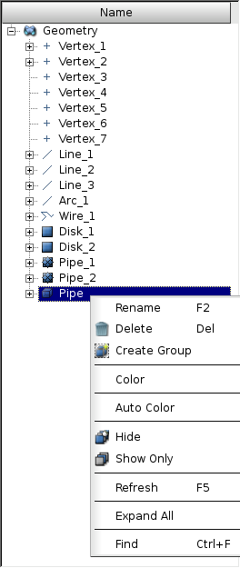
.. :width: 6cm

Select faces as shape (3rd button under Shape Type: one can select Vertices, Edges, Faces or Solids on a shape):

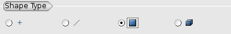
.. :width: 10cm

Give the name *Inlet1* to the new group and highlight (right click in the 3D view) the face corresponding to *Inlet1* on the *Pipe*. Then, push button *"Add"* (the number below identifies the face into the main shape), and apply. To be able to select a face, you may have to rotate the shape: *<Ctrl> + right click*.

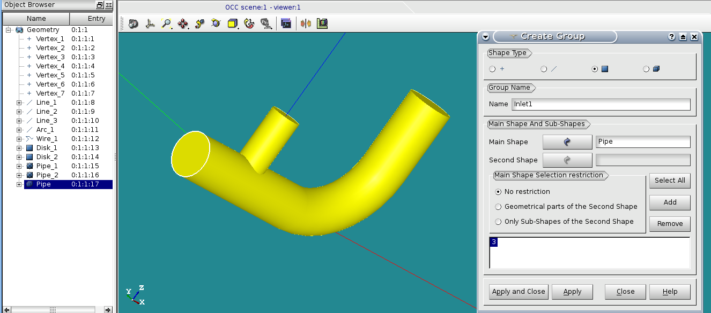

Proceed as above for the 3 other groups: *Inlet2*, *Outlet* and *Wall*. For faces selection of "Wall", use the *<Shift> + left click* to make a multiple selection: the wall is constituted with 4 faces.

.. image:: images/T_PIPE/t-pipe-geom-pipe_create_group_Inlet2.png
  :align: center

.. image:: images/T_PIPE/t-pipe-geom-pipe_create_group_Outlet.png
  :align: center

.. image:: images/T_PIPE/t-pipe-geom-pipe_create_group_Wall.png
  :align: center

Tips: choose the *shading* view mode insteed of the *wireframe* view mode, in order to select faces.

The CAD model (i.e. *Pipe*) is ready for meshing. Save your study (**"File > Save"** or *<Ctrl> + S*).

----------
4. Meshing
----------

In the scope of this tutorial, only the simplest way to mesh a CAD model is shown.

Activate the module **Mesh**.

4.1. Meshing with tetrahedrons, Netgen algorithm
================================================

- Select the *Pipe* object in **Object Browser**, then select menu **"Mesh > Create Mesh"**.

- In **"3D"** tab, select option **"Netgen 1D-2D-3D"** (nothing to do in the other tabs).

- Click on the only active button on **"Hypothesis"** line, and select **"NETGEN 3D Parameters"**.

- The **"Max. size"** corresponds to the maximal edge length of the tetrahedrons. Set the size is to 0.05.
  The **"Fineness"** governs the curves meshing. A fineness equal to **"fine**" will give approximately 6000 tetrahedrons,
  which is fine for this exercise.

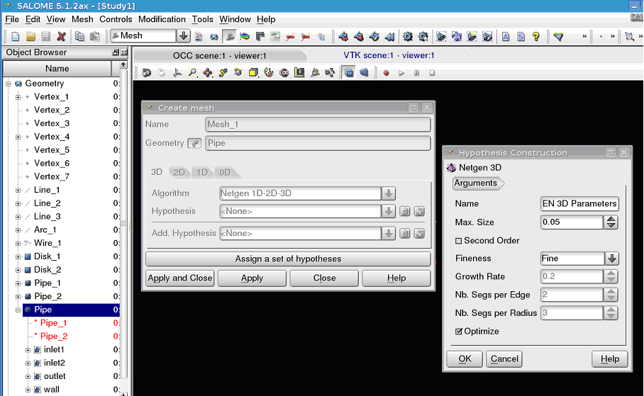

- After accepting the dialogs, select the new mesh in the **Object Browser** *Mesh_1*, and compute it by selecting
  the popup menu **"Compute"** or the toolbar button **"Compute"**.

- After a few seconds, the mesh is displayed, with an information dialog.

.. image:: images/T_PIPE/t-pipe-mesh-pipe_mesh_created.png
  :align: center

4.2. Groups on the mesh for boundary conditions definition
==========================================================

The groups defined on the CAD model for the boundary condition zones must have their counterparts in the mesh.

- Select the mesh *Mesh_1* in **Object Browser**, rename the mesh as *Pipe* with the popup menu **"Rename"**.
- Always with the mesh selected, create groups from Geometry (popup menu **"Create Groups from Geometry"**).
  In the **Object Browser** select the 4 groups defined on the CAD model. They appear in the dialog window. Apply.

.. image:: images/T_PIPE/t-pipe-mesh-pipe_create_group_2.png
  :align: center

- Display only the 3 groups corresponding to inlets and outlet, with the geometry in wireframe:

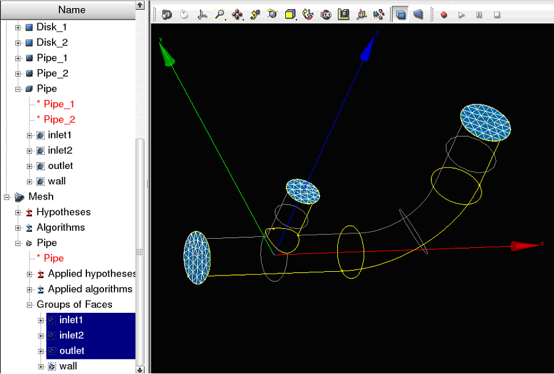

- Save the mesh in a MED file. Click left on mesh *Pipe* in **Object Browser** and select **"Export to MED File"**,
  and use the name *Pipe.med*.

Tips: verify that all faces belong to a single group.

The mesh *Pipe* is ready for a CFD calculation. Save your study (**"File > Save"** or *<Ctrl> + S*).

--------------------------------------
5. CFD calculation with *Code_Saturne*
--------------------------------------

Activate the module **CFDSTUDY**.

.. image:: ../images/CFDSTUDY_activation.png
  :align: center
.. :width: 12cm

- Click on **"New"**. A dialog window displays information about *Code_Saturne* installation.

.. image:: ../images/CFDSTUDY_info.png
  :align: center
.. :width: 10cm

If the installation of *Code_Saturne* is not found (see section 2) the following error
message is displayed:

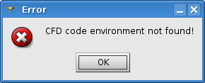
.. :width: 6cm

5.1. CFD study and case creation
================================

By convention, CFD calculations with *Code_Saturne* are organized in studies. Several calculations that share the same meshes and data sets,
define a study for *Code_Saturne*. Each data set defined in a case.

- Create a CFD study and a case by selecting the menu **"CFDSTUDY > Set CFD study location"** (or the equivalent button in the toolbar).

- Use **"Browse"** button to select the directory which will contain the study directory. In our scope, the study
  will be named *PIPESTUDY*, and the case *CASE1*.

  .. image:: images/T_PIPE/t-pipe-study_location.png
    :align: center
  .. :width: 10cm

  The new study directory with the new case is created with its sub directories and files.

- The **Object Browser** reflects the study structure on the directory :

  .. image:: images/T_PIPE/t-pipe-browser.png
    :align: center
  .. :width: 3cm

5.2. Open the *Code_Saturne* GUI
================================

- Open the *Code_Saturne* GUI by selecting *CASE1* or *SaturneGUI* with the left mouse button in **Object Browser** and
  click right on menu **"Launch GUI"**:

  .. image:: images/T_PIPE/t-pipe-browser-GUI.png
    :align: center
  .. :width: 3cm

- Then a window dialog appear, click on **"Activate"**. The *Code_Saturne* GUI open itself in the Salome dekstop.

  .. image:: images/T_PIPE/t-pipe-open_GUI.png
    :align: center 

On the left dockWidget, the salome **Object Browser** and the navigation tree of the GUI are grouped on tabs.
When an item of the tree is selected, the corresponding panel raises in the GUI.

5.3. Define the CFD calculation
===============================

Now we start to input data for the CFD calculation definition.
In the scope of this tutorial, we do not have to explore all the panels of the tree (from top to bottom),
because lot of default values are good, so we just have to fill a few panels.

5.3.1 Location of the mesh file
-------------------------------

Open **"Meshes selection"**.
Use **"Add"** button to open a file dialog, and select the MED file previously saved.

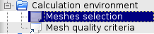
.. :width: 5cm

.. image:: images/T_PIPE/t-pipe-cfd-mesh-selection1.png 
  :align: center
.. :width: 11cm

5.3.2 Mesh quality criteria
-------------------------------

Open **"Mesh quality criteria"**.
Verify that the **"Post-processing format"** is choosen to MED.
Click on **"Check mesh"** button.

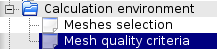
.. :width: 5cm

.. image:: images/T_PIPE/t-pipe-cfd-mesh-quality-criteria.png
  :align: center
.. :width: 11cm

The GUI displays a listing with information about quality. Then, refresh
the **Object Browser** with the toolbar button **"Updating Object browser"**. There are two new
MED file in the directory *RESU*: *PREPROCESSOR.med* and *QUALITY.med*.

.. image:: images/T_PIPE/t-pipe-cfd-mesh-quality-criteria1.png
  :align: center
.. :width: 6cm

The file *PREPROCESSOR.med* contains information on groups location.
The file *QUALITY.med* contains quality criteria as fields.
In order to visualize these quality criteria, export *QUALITY.med* in the **Post-Pro** module
(click right and select **"Export in Post-Pro"**).


.. :width: 4cm

Then activate the module **"Post-Pro"**, select the criteria to display (for example
click left and select **"Scalar Map"**):

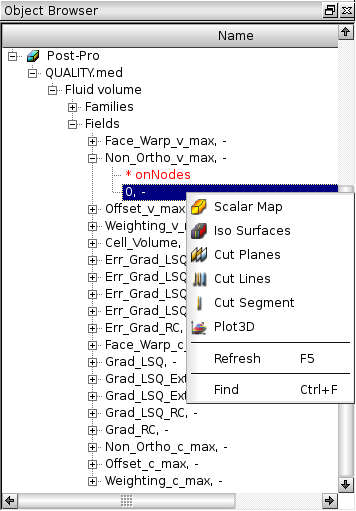
.. :width: 8cm

After exploring mesh quality criteria, re-activate the module **CFDSTUDY** in order
to continue the data input.

5.3.3 Thermophysical models
---------------------------

Open **"Thermal model"** and choose *Tempreature (Celsius)*.

.. image:: images/T_PIPE/t-pipe-cfd-temperature1.png 
  :align: center
.. :width: 5cm

.. image:: images/T_PIPE/t-pipe-cfd-temperature.png 
  :align: center
.. :width: 11cm

5.3.4 Fluid properties
----------------------

Open **"Fluid properties"**.

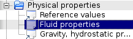
.. :width: 5cm

Here the tutorial proposes two options:

5.3.4.1 Constant properties
```````````````````````````

- Use constants for water at 19 degrees Celsius.

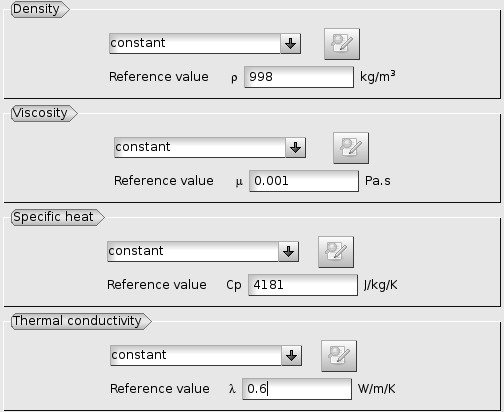
.. :width: 11cm

5.3.4.2 Variable properties
```````````````````````````

- *This section is optional*.
  User laws are proposed for density, viscosity and thermal conductivity.
  Fisrt, fill all properties like the section above, and then
  For density, viscosity and thermal conductivity, select **"user law"**, and open the window dialog
  in order to give the associated formula:

  - density: ``rho = 1000.94843 - 0.049388484 * TempC -0.000415645022 * TempC^2;``

  .. image:: images/T_PIPE/t-pipe-cfd-mei-rho.png
    :align: center
  .. :width: 11cm

  - viscosity: ``mu = 0.0015452 - 3.2212e-5 * TempC + 2.45422e-7 * TempC^2;``

  .. image:: images/T_PIPE/t-pipe-cfd-mei-mu.png
    :align: center
  .. :width: 11cm

  - thermal conductivity: ``lambda = 0.57423867 + 0.01443305 * TempC - 9.01853355e-7 * TempC^2;``

  .. image:: images/T_PIPE/t-pipe-cfd-mei-lambda.png
    :align: center
  .. :width: 11cm

  To take into account the effects of buoyancy, we have to impose a non-zero gravity.

  .. image:: images/T_PIPE/t-pipe-cfd-gravity.png
    :align: center
  .. :width: 5cm

  .. image:: images/T_PIPE/t-pipe-cfd-gravity1.png
    :align: center
  .. :width: 11cm

5.3.5 Initialization
--------------------

The initial temperature of the water in the pipe is set to 19 degrees.

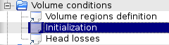
.. :width: 5cm

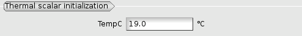
.. :width: 11cm

5.3.6 Boundary conditions
-------------------------

5.3.6.1 Define locations graphicaly
```````````````````````````````````

- Open **"Definition of boundary regions"**.

.. image:: images/T_PIPE/t-pipe-cfd-boundary-selection.png 
  :align: center
.. :width: 5cm

Highlight successively each group of the mesh *Pipe*, by selecting the name of the group in the **Object Browser** or by clicking
the group in the VTK scene. When the group is highlighted, click on the **"Add from Salome"** button.

.. image:: images/T_PIPE/t-pipe-cfd-boundary-selection_3.png 
  :align: center
.. :width: 11cm

By default the nature of each new imported group is *Wall*. Double click in the cell of the nature in order to edit it. In the same way, edit the label of the boundary condition zone.

.. image:: images/T_PIPE/t-pipe-cfd-boundary-selection_2.png 
  :align: center
.. :width: 11cm

5.3.6.2 Boundary conditions values
```````````````````````````````````

- Open **"Boundary conditions"**. For each inlet, give norm for the velocity, the hydraulic diameter for the turbulence, and the prescribed value for the temperature.

.. image:: images/T_PIPE/t-pipe-cfd-boundary-selection_1.png
  :align: center
.. :width: 5cm

.. image:: images/T_PIPE/t-pipe-cfd-boundary-values_1.png
  :align: center
.. :width: 11cm

.. image:: images/T_PIPE/t-pipe-cfd-boundary-values_2.png
  :align: center
.. :width: 11cm


5.3.7 Numerical parameters
--------------------------

5.3.7.1 Time step
`````````````````

- In the **"Time step"** heading, set 0.0002 s for the time step. The number of iterations is set to 1000.

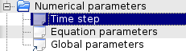
.. :width: 5cm

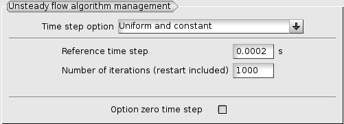
.. :width: 11cm

5.3.7.2 Equation parameters
```````````````````````````

- In order to save computation time, in the **"Solver"** tab, the precision is increase to 0.00001
  (select all the concerned cells, and *<Shift> + double right click* to edit all cells in a single time).

  .. image:: images/T_PIPE/t-pipe-cfd-eqn-parameters.png
    :align: center
  .. :width: 5cm

  .. image:: images/T_PIPE/t-pipe-cfd-eqn-parameters_1.png
    :align: center
  .. :width: 11cm

-  In the **"Scheme"** tab, the convective scheme for the temperature is set to *Upwind*.

  .. image:: images/T_PIPE/t-pipe-cfd-eqn-upwind.png
    :align: center
  .. :width: 11cm


5.3.7.3 Global parameters
`````````````````````````

- The default gradient calculation method is changed for *Least Squares method over partial extended cell neighborhood*, which is better for full tetrahedrons mesh.

.. image:: images/T_PIPE/t-pipe-cfd-global-parameters.png
  :align: center
.. :width: 5cm

.. image:: images/T_PIPE/t-pipe-cfd-global-parameters_1.png
  :align: center
.. :width: 11cm

5.3.8 Calculation control: define monitoring points
---------------------------------------------------

The purpose of the monitoring points is to record for each time step, the value of selected variables.
It allows to control stability and convergence of the calculation.

     ========     ======  ======  =====
      Number       X      Y       Z
     ========     ======  ======  =====
     1            0.06    0.036   0
     2            0.06    0       0.036
     3            0.06    -0.036  0
     4            0.06    0       -0.036
     5            0.096   0.04    0
     6            0.1     0.006   0.036
     7            0.121   -0.028  0
     8            0.1     0.006   -0.036
     9            0.135   0.113   0
     10           0.171   0.113   0.036
     11           0.207   0.113   0
     12           0.171   0.113   -0.036
     ========     ======  ======  =====

.. image:: images/T_PIPE/t-pipe-cfd-probes.png
  :align: center
.. :width: 5cm

.. image:: images/T_PIPE/t-pipe-cfd-probes_1.png
  :align: center
.. :width: 11cm


5.4 Calculation
===============

Select **"Prepare batch calculation"**.

.. image:: images/T_PIPE/t-pipe-cfd-calculation-selection.png 
  :align: center  
.. :width: 5cm

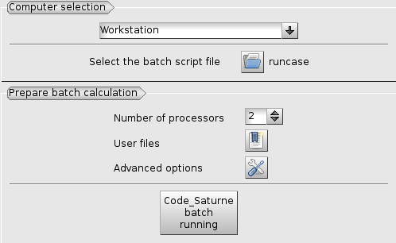
.. :width: 11cm

Before running *Code_Saturne*, save the case file (toolbar button or **"File > Code_Saturne > Save as
data xml file"** or *<Shif> + <Ctrl> + S*), with the name "tjunction.xml" (extension .xml must be explicit).
It is possible to see the listing in real time, in order to do that in the **"Advanced Options"** the option
*to listing* must be replaced by *to standard output*.

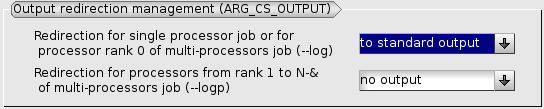
.. :width: 12cm

Click on Button **"Code Saturne batch running"**.

When the calculation is finished (success or error), a new folder appears in the **Object Browser**, in "RESU" folder under "CASE1". The **Object Browser** looks like:

.. image:: images/T_PIPE/t-pipe-cfd-calculation-browser.png 
  :align: center
.. :width: 8cm

Export the result *chr.med* and the probes files (extension *.dat*) into the **Post-Pro** module,
with the popup menu **"Export in Post Pro"**.


.. :width: 4cm

In case of troubles, check these causes:

- the **Object Browser** does not reflect correctly the study
  (try the popup menu **"Update Object Browser"** on  *PIPESTUDY*

- the **Object Browser** is not correctly refreshed (popup menu *Refresh* in the **Object Browser**),

- if nothing, look at the temporary directory for the calculation, in $HOME/tmp_Saturne. Listings of compilation and execution are here.

----------------------------------
6. Post processing of the solution
----------------------------------

6.1 Create curves for the monitoring points
===========================================

First, export in the **Post-Pro** module the files of monitoring points (extension *.dat*) to be created.
For example, export the monitoring points concerning the temperature: *probes_TempC.dat* :

.. image:: images/T_PIPE/t-pipe-visu-probes-export.png
  :align: center
.. :width: 5cm

Then activate the **Post-Pro** module. Select the popup menu **"Create Curves"** (*click left* on *TempC*)

.. image:: images/T_PIPE/t-pipe-visu-probes-curves.png
  :align: center
.. :width: 8cm

In the dialog window **"Setup Plot 2d"** click on the two marked buttons:

.. image:: images/T_PIPE/t-pipe-visu-probes-setup-plot2D.png
  :align: center

**Post-Pro** ask if *Do you want to choose all items with the same units for vertical axis?*. Answer *Yes* and click *Ok*.

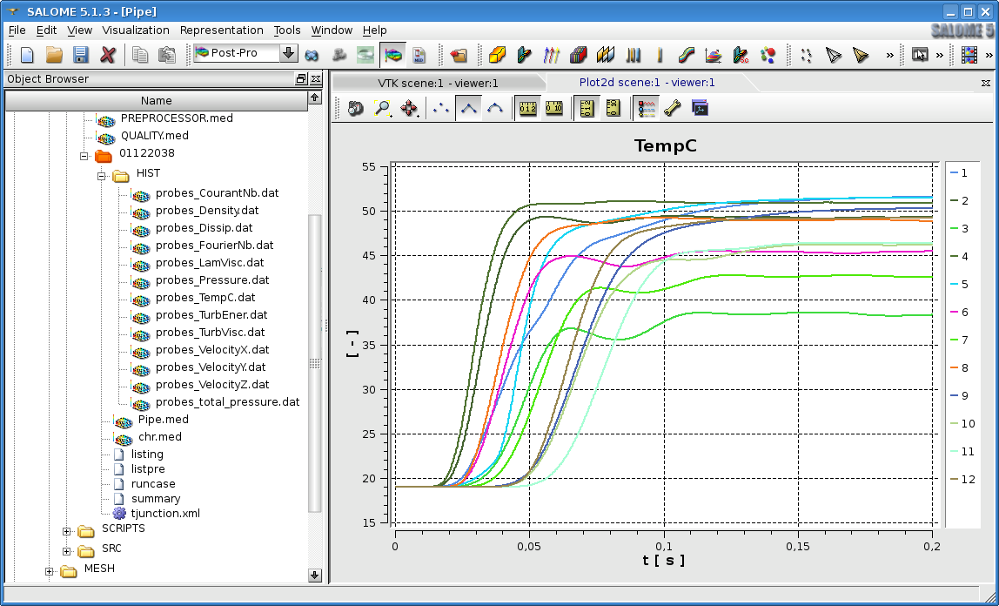

6.2 Visualisation of colored maps
=================================

First, export in the **Post-Pro** module the results file *chr.med*.

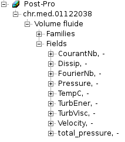
.. :width: 5cm

Activate the **Post-Pro** module. Select the variable (*TempC*) and the time step (*0.2* here) to display.
The select the popup menu **"ScalarMap"**, **"IsoSurfaces"** or **"CutPlanes"** (*click left* on *TempC*).

.. image:: images/T_PIPE/t-pipe-visu-chr-colored-map.png
  :align: center
.. :width: 8cm

.. image:: images/T_PIPE/t-pipe-visu-chr-colored-map_1.png
  :align: center

.. image:: images/T_PIPE/t-pipe-visu-chr-colored-map_2.png
  :align: center

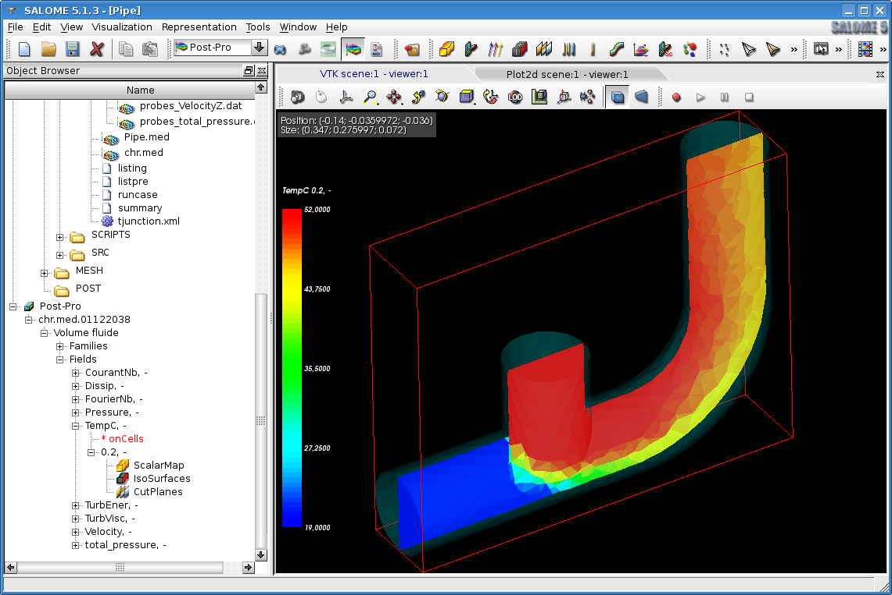

6.3 Velocity vector and streamlines
====================================

Select the *Velocity* and the time step (*0.2* here) to display.
The select the popup menu **"Vectors"** or **"StreamLines"** (*click left* on *Velocity*).

.. image:: images/T_PIPE/t-pipe-visu-chr-velocity.png
  :align: center
.. :width: 8cm

.. image:: images/T_PIPE/t-pipe-visu-chr-velocity_1.png
  :align: center

.. image:: images/T_PIPE/t-pipe-visu-chr-streamlines.png
  :align: center
