==============================================================
*Code_Saturne* tutorial: **turbulent mixing in a T-junction**
==============================================================

----------------
Introduction
----------------

This tutorial provides a complete course with *Code_Saturne*.

This tutorial is covering the following items:

- first, creation of the CAD design with the module **Geometry**
- then the meshing step with the module **Mesh**
- in order to do a CFD calculation, do a setup of *Code_Saturne* through the module **CFDSTUDY**
- at last, some elements for the post processing of the results with the module **Paravis**

The proposed case is on turbulent mixing between cold and hot water inside a
pipe. The pipe is composed with a T-junction and an elbow. This exercise is
inspired from a more complex study of thermal fatigue caused by the turbulent
mixing of hot and cold flows just upstream of the elbow. Of course, the case is
very simplified here.

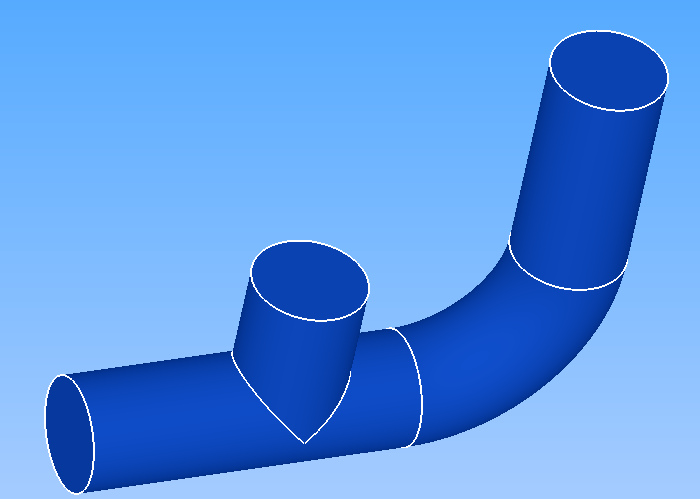

----------------
Open SALOME
----------------

Two ways are possible to launch salome with Code_Saturne:

 - if you have downloaded salome_cfd, to open salome the command is ``~/salome/appli_x_y_z/salome``.

 - if Code_Saturne is a post installation process, then the command to open salome is ``./code_saturne salome``.

For information about installation of *Code_Saturne* with SALOME, please consult the installation guide
of *Code_Saturne*.

-------------------------------------
CAD design with the module Geometry
-------------------------------------

The CAD model is built by extrusion of disks along paths (i.e. lines and wires).
We need to define two paths for the two tubes, and two disks which are faces
built on circles. The two volumes obtained are regrouped into one volume
(fusion).

After the construction of the solid, we have to define the **boundary conditions
zones** for the CFD calculation: that is to say two inlet faces, the outlet
face, and the internal wall of the tubes.

- **Note**: objects graphical manipulation in the 3D view (rotation, zoom, translation) can be done with *<Ctrl> + mouse buttons*.

Activate the module **Geometry**.

~~~~~~~~~~~~~~~~~~~~~~
Points, lines and wire
~~~~~~~~~~~~~~~~~~~~~~

- Creation of points: add the following variables on the Notebook Windows:

     =============  ==============
     Variable_Name  Variable_Value
     =============  ==============
     P1             -0.14
     P2              0.1
     P3              0.095
     P4              0.171
     P5              0.24
     P6              0.076
     radius          0.036
     =============  ==============

  .. image:: images/T_PIPE/t-pipe-geom-notebook.png
    :align: center
    :width: 11cm

  Select the menu **"New Entity > Basic > Point"** or click
  the toolbar button **"Create a Point"**. In the dialog window for the creation
  of the points create the following entities:

     ========     ======  ======  =====
      Name         X      Y       Z
     ========     ======  ======  =====
     Vertex_1     P1      0       0
     Vertex_2     0       0       0
     Vertex_3     P6      0       0
     Vertex_4     0       P2      0
     Vertex_5     P6      P3      0
     Vertex_6     P4      P3      0
     Vertex_7     P4      P5      0
     ========     ======  ======  =====

  The points are not visible without a zoom. After 3 or 4 new points, use the mouse wheel to zoom in.

  .. image:: images/T_PIPE/t-pipe-geom-vertex.png
    :align: center

- Creation of the lines: select the menu **"New Entity > Basic > Line"** (or click the equivalent toolbar button).
  To define a line, select successively the begin and end point, either in **Object Browser** or in the 3D view.

  .. image:: images/T_PIPE/t-pipe-geom-line.png
    :align: center
    :width: 11cm

  Three lines must be defined:

     ========  ========  ========
      Name     Point1    Point2
     ========  ========  ========
     Line_1    Vertex_1  Vertex_3
     Line_2    Vertex_2  Vertex_4
     Line_3    Vertex_6  Vertex_7
     ========  ========  ========

- Creation of the arc (a 1/4 of circle): select the menu **"New Entity > Basic > Arc"** (or click the equivalent toolbar button). Then,
  in the dialog window, select the second mode of creation (i.e. with a center point, and two points).

  .. image:: images/T_PIPE/t-pipe-geom-arc-mode.png
    :align: center
    :width: 10cm

  Then the arc must be defined:

     ========  ============  ===========  ==========
      Name     Center Point  Start Point  End Point
     ========  ============  ===========  ==========
     Arc_1     Vertex_5      Vertex_3     Vertex_6
     ========  ============  ===========  ==========

  .. image:: images/T_PIPE/t-pipe-geom-arc.png
    :align: center

- Creation of the wire: select the menu **"New Entity > Build > Wire"**.
  To select together *Line_1*, *Arc_1* and *Line_3*, use *<Ctrl> + left click* in the **Object Browser**.

  .. image:: images/T_PIPE/t-pipe-geom-wire.png
    :align: center

- **Note**: in order to create this wire, we could use also the menu **"New Entity > Sketch"**.


~~~~~~~~~~~~~~~~~~~~~~
Faces and pipes
~~~~~~~~~~~~~~~~~~~~~~

- Creation of the two disks: open the dialog window with the menu **"New Entity > Primitive > Disk"**. For each disk,
  in the dialog window, select the second mode of creation (i.e. with a center point, a vector and a radius).

  .. image:: images/T_PIPE/t-pipe-geom-disk-mode.png
    :align: center
    :width: 10cm

  In the hierarchical geometric entities, these disks are faces.

     ========  ============  ===========  ======
      Name     Center Point  Vector       Radius
     ========  ============  ===========  ======
     Disk_1    Vertex_1      Line_1       radius
     Disk_2    Vertex_4      Line_2       radius
     ========  ============  ===========  ======

  .. image:: images/T_PIPE/t-pipe-geom-disk1.png
    :align: center

  .. image:: images/T_PIPE/t-pipe-geom-disk2.png
    :align: center

- Creation of the two pipes: select the menu **"New Entity > Generation > Extrusion Along a Path"**. In our case the two
  paths are respectively: *Wire_1* and *Line_2*. In the hierarchical geometric entities, these pipes are solids.

     ========  ===========  ===========
      Name     Base Object  Path Object
     ========  ===========  ===========
     Pipe_1    Disk_1       Wire_1
     Pipe_2    Disk_2       Line_2
     ========  ===========  ===========

  .. image:: images/T_PIPE/t-pipe-geom-pipe1.png
    :align: center

  .. image:: images/T_PIPE/t-pipe-geom-pipe2.png
    :align: center

~~~~~~~~~~~~~~~~~~~~~~~~~~
Fusion of the two pipes
~~~~~~~~~~~~~~~~~~~~~~~~~~

- At that stage, we have build two separate solids. We must fuse these two solids into a single one.
  In order to do this fusion, select the menu **"Operations > Boolean > Fuse"**. Then rename the new object as *Pipe*
  (by default, is name is *Fuse_1*).

     ========  ===========  ===========
      Name     Object 1     Object 2
     ========  ===========  ===========
     Pipe      Pipe_1       Pipe_2
     ========  ===========  ===========

  .. image:: images/T_PIPE/t-pipe-geom-pipe-fuse.png
    :align: center
    :width: 11cm

- Use the menus **"Inspection > Check shape"** and **"Inspection > What is"** to verify the object *Pipe*. It must be constituted of a single solid.

  .. image:: images/T_PIPE/t-pipe-geom-pipe_check.png
    :align: center


~~~~~~~~~~~~~~~~~~~~~~~~~~~~~~~~~~~~~~~~~~~
Groups for boundary conditions definition
~~~~~~~~~~~~~~~~~~~~~~~~~~~~~~~~~~~~~~~~~~~

Fisrt, choose the *shading* view mode instead of the *wireframe* view mode, in order to select faces in the menu **"View > Display Mode"**.

In the **Object Browser**, select the *Pipe* object, use popup menus **"Show only"** and **"Create group"**.

.. image:: images/T_PIPE/t-pipe-geom-pipe_create_group-popup.png
  :align: center
  :width: 6cm

Select faces as shape type (3rd choice under **Shape Type** header: one can select Vertices, Edges, Faces or Solids on a shape):

.. image:: images/T_PIPE/t-pipe-geom-pipe_create_group-shape_type.png
  :align: center
  :width: 10cm

Give the name *Inlet1* to the new group and highlight (right click in the 3D view) the face corresponding to *Inlet1* on the *Pipe*. Then, push button *"Add"* (the number below identifies the face into the main shape), and apply. To be able to select a face, you may have to rotate the shape: *<Ctrl> + right click*.

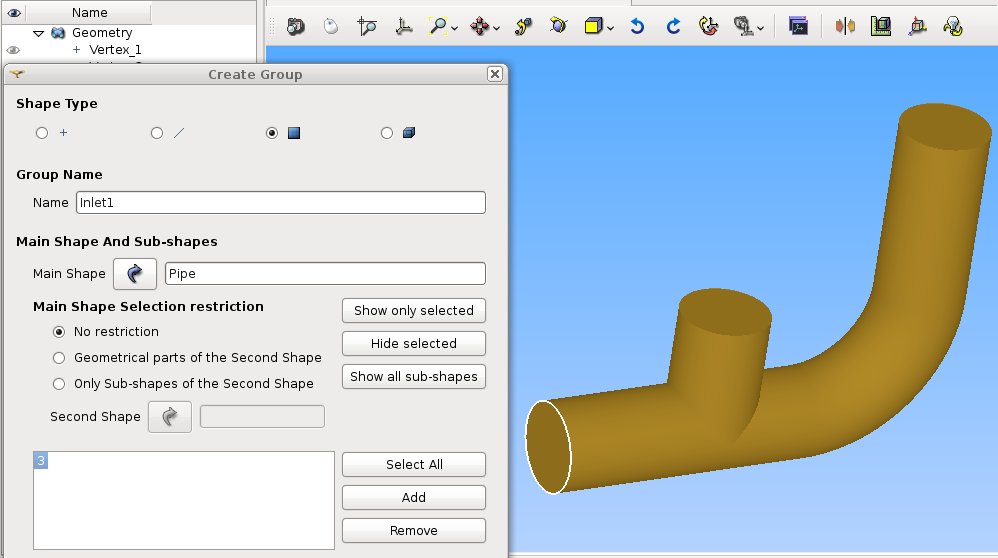

Proceed as above for the 3 other groups: *Inlet2*, *Outlet* and *Wall*. For faces selection of "Wall", use the *<Shift> + left click* to make a multiple selection: the wall is constituted with 4 faces.


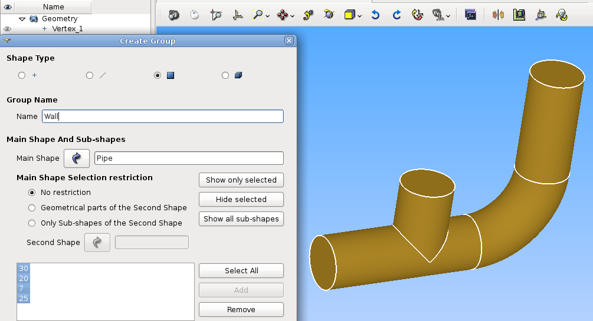

The CAD model (i.e. *Pipe*) is ready for meshing. Save your study (**"File > Save"** or *<Ctrl> + S*).

----------
Meshing
----------

In the scope of this tutorial, only the simplest way to mesh a CAD model is shown.

Activate the module **Mesh**.

~~~~~~~~~~~~~~~~~~~~~~~~~~~~~~~~~~~~~~~~~~~
Mesh with a layer of prisms on *Wall*
~~~~~~~~~~~~~~~~~~~~~~~~~~~~~~~~~~~~~~~~~~~

- Select the *Pipe* object in **Object Browser**, then select menu **"Mesh > Create Mesh"**.

- In **"3D"** tab, select option **"(Tetrahedron) Netgen"**.

- Click on the only active button on **"Add Hypothesis"** line, and select **"Viscous Layer"**.

- Click on the only active button on **"Add Hypothesis"** line, and select **"Viscous Layer"**.
  Set the **"Total thickness"** to 0.015 and the **"Number of layers"** to 3. Then add the Faces
  without layers: select in the Object Browser the groups *Inlet1*, *Inlet2* and *Outlet* in *Geometry*
  and click on the **Add** button.

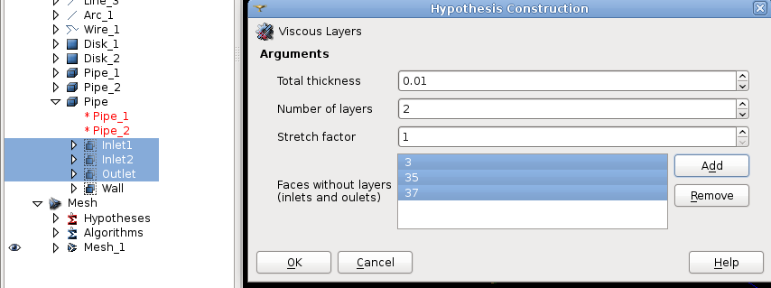

- In **"2D"** tab, select option **"Netgen 1D-2D"** (nothing to do in the other tabs 1D and 0D).

- Click on the only active button on **"Hypothesis"** line, and select **"NETGEN 2D Parameters"**.

- The **"Max. size"** and the **"Min. size"** correspond to the maximal and minimal edge length of the tetrahedrons. Set the sizes to 0.025 and 0.012.
  The **"Fineness"** governs the curves meshing: set fineness equal to **"Very fine**", and finally select **"Allow Quadrangles"**.

- After accepting the dialogs, select the new mesh in the **Object Browser** *Mesh_1*, and compute it by selecting
  the popup menu **"Compute"** or the toolbar button **"Compute"**.

- After a few seconds, the mesh is displayed, with an information dialog.

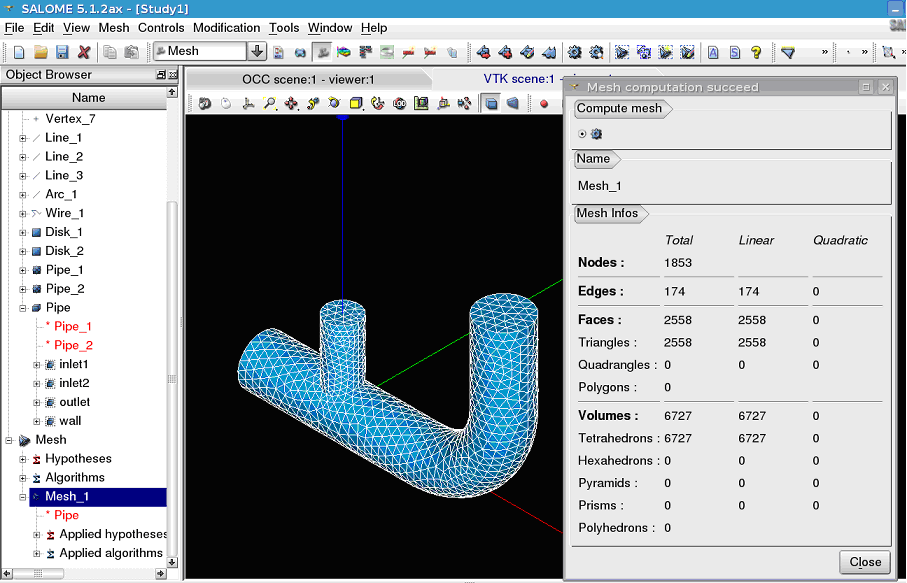

- **Note**: for a full tetrahedrons mesh, in **"3D"** tab just select option **"Netgen 1D-2D-3D"** (nothing to do in the other tabs),
  and fit hypothesis by clicking on the only active button on **"Hypothesis"** line, and select **"NETGEN 3D Parameters"**.


~~~~~~~~~~~~~~~~~~~~~~~~~~~~~~~~~~~~~~~~~~~~~~~~~~~~~~~
Groups on the mesh for boundary conditions definition
~~~~~~~~~~~~~~~~~~~~~~~~~~~~~~~~~~~~~~~~~~~~~~~~~~~~~~~

The groups defined on the CAD model for the boundary condition zones must have their counterparts in the mesh.

- Select the mesh *Mesh_1* in **Object Browser**, rename the mesh as *Pipe* with the popup menu **"Rename"**.
- With the mesh still selected, create groups from Geometry (popup menu **"Create Groups from Geometry"**).
  In the **Object Browser** select the 4 groups defined on the CAD model. They appear in the dialog window. Apply.

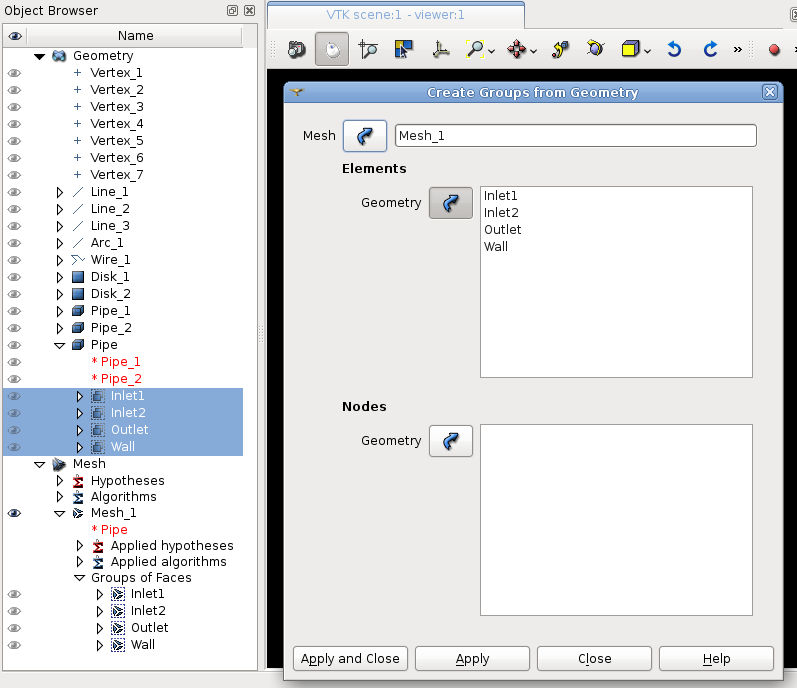

- Display only the 3 groups corresponding to inlets and outlet:

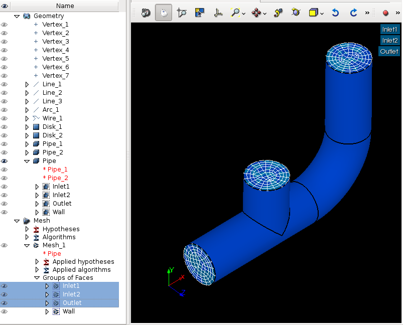

- Save the mesh in a MED file. Click left on mesh *Pipe* in **Object Browser** and select **"Export to MED File"**,
  and use the name *Pipe.med*.

Warning: verify that all faces belong to a single group.

The mesh *Pipe* is ready for a CFD calculation. Save your study (**"File > Save"** or *<Ctrl> + S*).

--------------------------------------
CFD calculation with *Code_Saturne*
--------------------------------------

Activate the module **CFDSTUDY**.

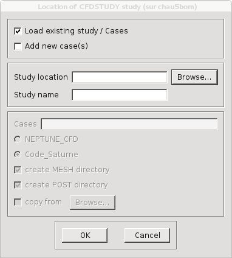

By convention, CFD calculations with *Code_Saturne* are organized in studies and cases. Several calculations that share the same meshes and data sets,
define a study for *Code_Saturne*. Each data set defined in a case.

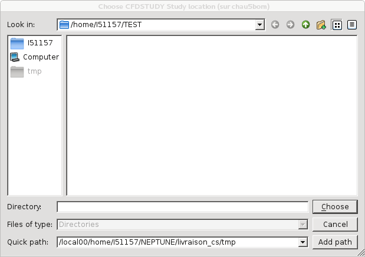

Click on **"Add new case(s)"**. Then, use **"Browse"** button to select the directory which will contain the study directory.

.. image:: images/T_PIPE/t-pipe-study_location_add_new_case.png
  :align: center
  :width: 10cm

Now, define the **Study name** ("PIPESTUDY") and **Cases** ("CASE1"). The choice for the code is Code_Saturne. Please,
verify **create MESH directory** is checked.

The new study directory with the new case is created with its sub directories and files.
Move the mesh file *Pipe.med* in the directoty MESH of the study.

- The **Object Browser** reflects the study structure on the directory:

  .. image:: images/T_PIPE/t-pipe-browser.png
    :align: center

~~~~~~~~~~~~~~~~~~~~~~~~~~~~~~~~~~~~~~~~~~~~~~~~~~~~~~~
Open the *Code_Saturne* GUI
~~~~~~~~~~~~~~~~~~~~~~~~~~~~~~~~~~~~~~~~~~~~~~~~~~~~~~~

- Open the *Code_Saturne* GUI by selecting *CASE1* or *SaturneGUI* with the left mouse button in **Object Browser** and
  click right on menu **"Launch GUI"**:

  .. image:: images/T_PIPE/t-pipe-browser-GUI.png
    :align: center
    :width: 3cm

- Then a window dialog appear, click on **"Activate"**. The *Code_Saturne* GUI open itself in the SALOME dekstop.

  .. image:: images/T_PIPE/t-pipe-open_GUI.png
    :align: center

On the left dockWidget, the salome **Object Browser** and the navigation tree of the GUI are grouped on tabs.
When an item of the tree is selected, the corresponding panel raises in the GUI.

~~~~~~~~~~~~~~~~~~~~~~~~~~~~~~~~~~~~~~~~~~~~~~~~~~~~~~~
Define the CFD calculation
~~~~~~~~~~~~~~~~~~~~~~~~~~~~~~~~~~~~~~~~~~~~~~~~~~~~~~~

Now we start to input data for the CFD calculation definition.
In the scope of this tutorial, we do not have to explore all the panels of the tree (from top to bottom),
because lot of default values are adapted to this case, so we just have to fill a few panels.

Location of the mesh file
-------------------------------

Open **"Meshes selection"**.
Use **"Add"** button to open a file dialog, and select the MED file previously saved.

.. image:: images/T_PIPE/t-pipe-cfd-mesh-selection.png
  :align: center
  :width: 5cm

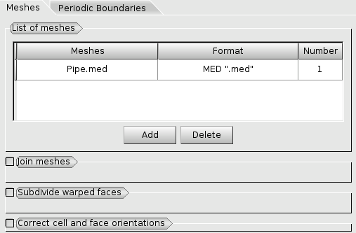


Mesh quality criteria
-------------------------------

Open **"Mesh quality criteria"**.
Verify that the **"Post-processing format"** is choosen to Ensight Gold.
Click on **"Check mesh"** button.

.. image:: images/T_PIPE/t-pipe-cfd-mesh-quality-criteria3.png
  :align: center
  :width: 5cm

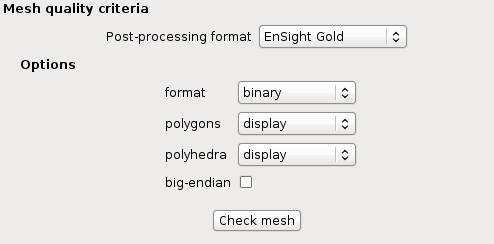

The GUI displays a listing with information about quality. Then, refresh
the **Object Browser** with the toolbar button **"Updating Object browser"**. There are new
directories *check_mesh/postprocessing* in the *RESU* directory.

The file *BOUNDARY_GROUPS.case* and *MESH_GROUPS.case* contain information on groups location.
The file *QUALITY.case* contains quality criteria as fields.
In order to visualize these quality criteria, we have to open the **Paravis** module
and open the *QUALITY.case* file from the *postprocessing* directory.

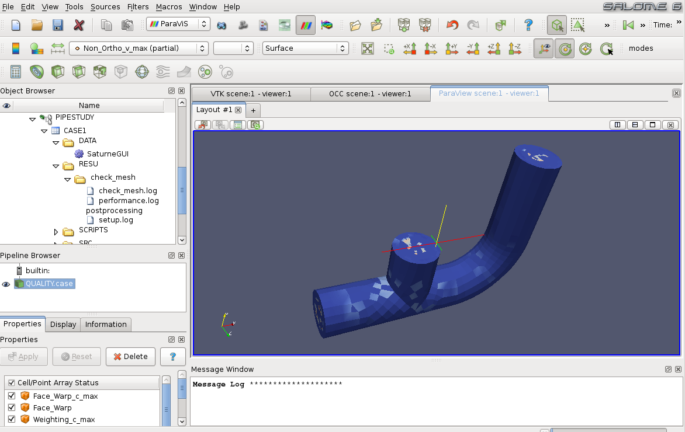

After exploring mesh quality criteria, re-activate the module **CFDSTUDY** in order
to continue the data input.

Thermophysical models
---------------------------

Open **"Thermal model"** and choose *Temperature (Celsius)*.

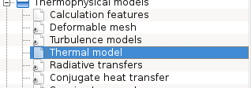

.. image:: images/T_PIPE/t-pipe-cfd-temperature.png
  :align: center

Fluid properties
----------------------

.. image:: images/T_PIPE/t-pipe-cfd-fluid-properties.png
  :align: center

Open **"Fluid properties"**.

- Set reference values for water at 19 degrees Celsius:

    - density: 998 kg/m3
    - viscosity: 0.001 Pa.s
    - Specific heat: 4181 J/kg/K
    - thermal conductivity: 0.6 W/m/K

  .. image:: images/T_PIPE/t-pipe-cfd-fluid-properties-all.png
    :align: center
    :width: 11cm

- User laws are imposed for density, viscosity and thermal conductivity.
  For density, viscosity and thermal conductivity, select **"user law"**, and open the window dialog
  in order to give the associated formula:

  - density: ``density = 1000.94843 - 0.049388484 * temperature -0.000415645022 * temperature^2;``

    .. image:: images/T_PIPE/t-pipe-cfd-mei-rho.png
      :align: center

  - viscosity: ``molecular_viscosity = 0.0015452 - 3.2212e-5 * temperature + 2.45422e-7 * temperature^2;``

    .. image:: images/T_PIPE/t-pipe-cfd-mei-mu.png
      :align: center

  - thermal conductivity: ``thermal_conductivity = 0.57423867 + 0.01443305 * temperature - 9.01853355e-7 * temperature^2;``

    .. image:: images/T_PIPE/t-pipe-cfd-mei-lambda.png
      :align: center

  To take into account the effects of buoyancy, we have to impose a non-zero gravity.

  .. image:: images/T_PIPE/t-pipe-cfd-gravity.png
    :align: center

  .. image:: images/T_PIPE/t-pipe-cfd-gravity1.png
    :align: center
    :width: 11cm

Initialization
--------------------

The initial temperature of the water in the pipe is set to 19 degrees.

.. image:: images/T_PIPE/t-pipe-cfd-initialization.png
  :align: center

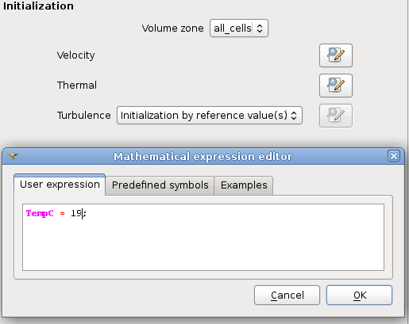

Boundary conditions
-------------------------

Define locations graphically
`````````````````````````````````````

- Open **"Definition of boundary regions"**.

.. image:: images/T_PIPE/t-pipe-cfd-boundary-selection.png
  :align: center

Highlight successively each group of the mesh *Pipe*, by selecting the name of the group in the **Object Browser** or by clicking
the group in the VTK scene. When the group is highlighted, click on the **"Add from Salome"** button.

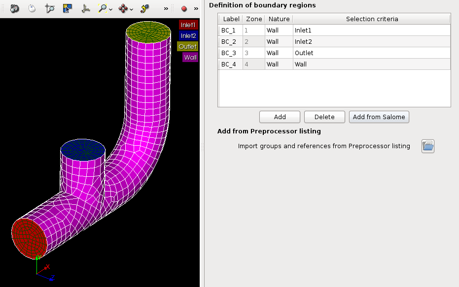

By default the nature of each new imported group is *Wall*. *Double click* in the cell of the nature in order to edit it. In the same way, edit the label of the boundary condition zone.

.. image:: images/T_PIPE/t-pipe-cfd-boundary-selection_2.png
  :align: center
  :width: 11cm

Boundary condition values
```````````````````````````````````

- Open **"Boundary conditions"**. For each inlet, give norm for the velocity, the hydraulic diameter for the turbulence, and the prescribed value for the temperature, as shown on the figures below.

.. image:: images/T_PIPE/t-pipe-cfd-boundary-selection_1.png
  :align: center

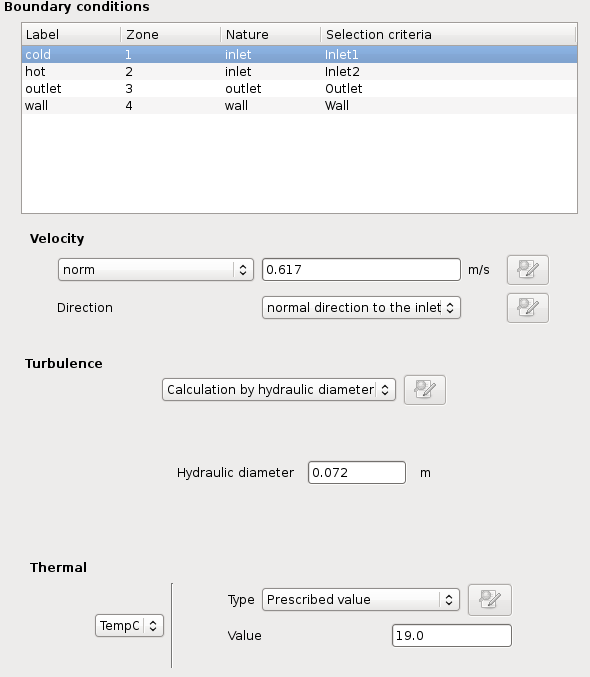

.. image:: images/T_PIPE/t-pipe-cfd-boundary-values_2.png
  :align: center
  :width: 11cm


Numerical parameters
--------------------------

Global parameters
`````````````````````````

- The default gradient calculation method is changed to *Iterative method with Least Squares initialization*.

.. image:: images/T_PIPE/t-pipe-cfd-global-parameters.png
  :align: center

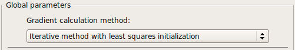

Equation parameters
```````````````````````````

- In order to save computation time, in the **"Solver"** tab, the precision is increase to 1.e-5
  (select all the concerned cells, and *<Shift> + double right click* to edit all cells in a single time).

  .. image:: images/T_PIPE/t-pipe-cfd-eqn-parameters.png
    :align: center

  .. image:: images/T_PIPE/t-pipe-cfd-eqn-parameters_1.png
    :align: center

-  In the **"Scheme"** tab, the convective scheme for the velocity is set to *SOLU* and for the turbulent variables and the temperature is set to *Upwind*.

  .. image:: images/T_PIPE/t-pipe-cfd-eqn-upwind.png
    :align: center


Time step
`````````````````

- In the **"Time step"** heading, set 0.0001 s for the time step. The number of iterations is set to 2000.

.. image:: images/T_PIPE/t-pipe-cfd-time-step.png
  :align: center
  :width: 5cm

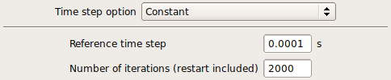

Calculation control
-------------------------

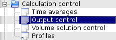

Writer
`````````````````

In the **"Output control"** heading, tab **"Writer"**, define a frequency for the post-processing output, in order to do temporal animation with results.

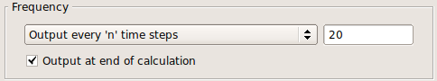

Define monitoring points
`````````````````````````````

The purpose of the monitoring points is to record for each time step, the value of selected variables.
It allows to control stability and convergence of the calculation.

     ========     ======  ======  =====
      Number       X      Y       Z
     ========     ======  ======  =====
     1            0.06    0.036   0
     2            0.06    0       0.036
     3            0.06    -0.036  0
     4            0.06    0       -0.036
     5            0.096   0.04    0
     6            0.1     0.006   0.036
     7            0.121   -0.028  0
     8            0.1     0.006   -0.036
     9            0.135   0.113   0
     10           0.171   0.113   0.036
     11           0.207   0.113   0
     12           0.171   0.113   -0.036
     ========     ======  ======  =====

The positions of the monitoring points are displayed on the SALOME view. The probes radius is set to 0.005 m.

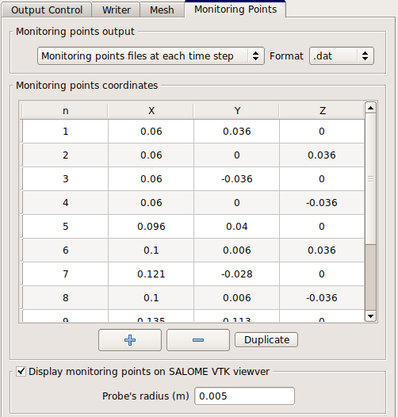

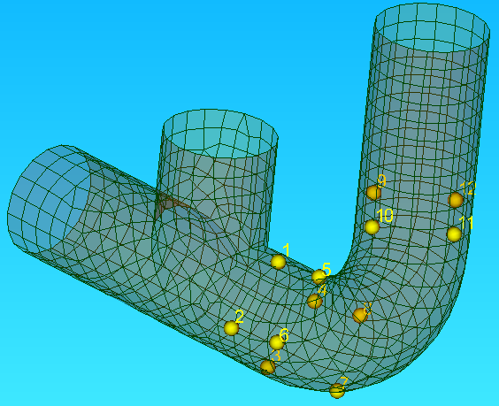

The format to be choosen (*dat* or *csv*) depends of the software which will plot the curves. For **Paravis**, *csv* must be selected.


Calculation
-------------------------

Select **"Prepare batch calculation"** heading.

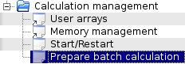

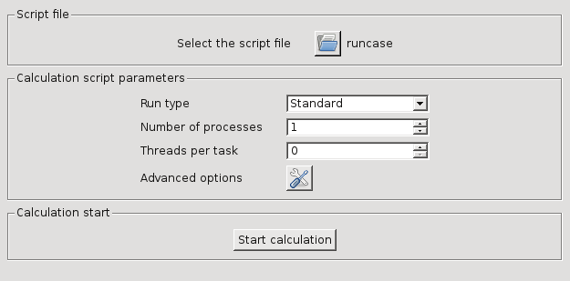

Before running *Code_Saturne*, save the case file (toolbar button or **"File > Code_Saturne > Save as
data xml file"** or *<Shif> + <Ctrl> + S*), with the name "tjunction.xml" (extension .xml could be ommited).
It is possible to see the listing in real time, in order to do that in the **"Advanced Options"** the option
*to listing* must be replaced by *to standard output*.

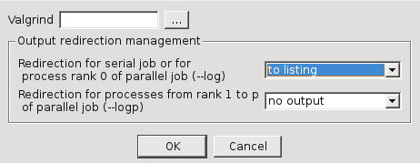

Click on Button **"Code_Saturne batch running"**. A popup window raises during the computation. When the computation is completed, click on **OK** to close the window.

----------------------------------
Post processing of results
----------------------------------

In this section only the loading of the data in **Paravis** and the first steps are covered.

Activate the module **Paravis**, then load the RESULTS.case by clicking the menu **File > Open ParaView file**. Click on the green button *Apply*. Now the data are loaded.

If more than a single mesh is present in the data (aka Part with the Ensight vocabulary), the filter *Extract Block* should be apply;
select: **Filters > Alphabetical > Extract Block**. Then, in the *Propeties* tab, select the checkbox corresponding to the mesh to display, and click on the green button *Apply*.

It is possible to project cell data to the vertex; select **Filters > Alphabetical > Cell Data to Point Data**, and click on the green button *Apply*.

Finally, select in the *Display* tab the variable to color the mesh.


